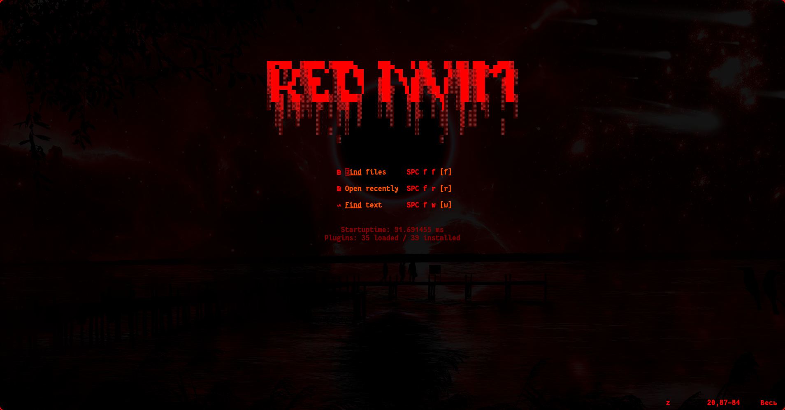
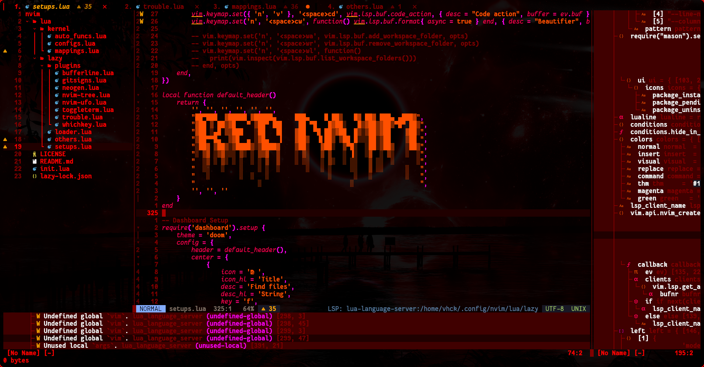
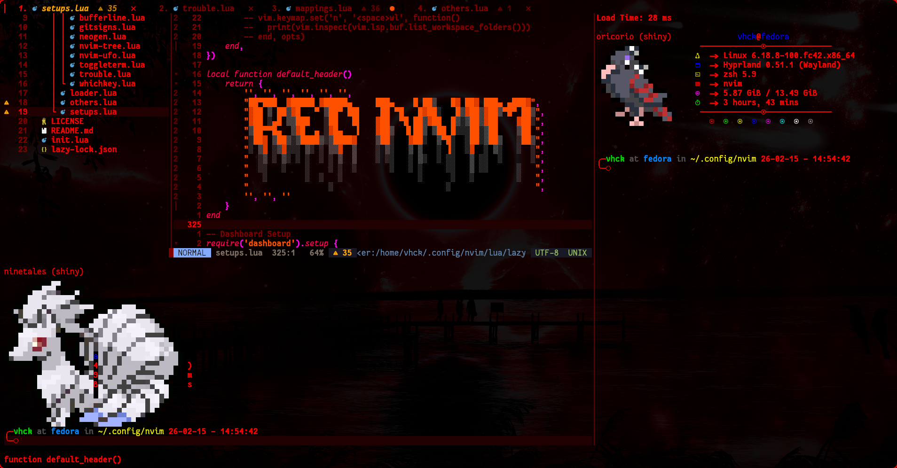
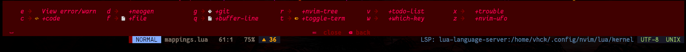

## Preview




## Tips
- press `spece w a` to see all binds
- press `ctrl a` to select all text in file
- press `ctrl s` to save file
- press `ctrl q` to quit
- u can change colorscheme in `~/.config/nvim/lua/kernel/configs.lua`
## Installation
- If you already have neovim, make backups of your configuration.
```sh
sudo dnf install neovim lazygit
rm -rf ~/.config/nvim ~/.local/share/nvim ~/.local/state/nvim ~/.cache/nvim
mkdir -p ~/.config/nvim
git clone https://github.com/v-hck/red-nvim ~/.config/nvim
cp ~/.config/nvim/lua/lazy/editme/presence_default.lua ~/.config/nvim/lua/lazy/editme/presence.lua
cp ~/.config/nvim/lua/lazy/editme/codestats_default.lua ~/.config/nvim/lua/lazy/editme/codestats.lua
sudo cp ~/.config/nvim/for_copy/red.vim /usr/share/nvim/runtime/colors/red.vim
nvim ~/.config/nvim/lua/lazy/editme -c "MasonInstall actionlint basedpyright circleci-yaml-language-server flakeheaven hyprls lua-language-server luacheck luau-lsp pyright ruff selene stylua vim-language-server vint biome"
```
## Post Installation
```sh
cp ~/.config/nvim/for_copy/luau1.lua ~/.local/share/nvim/lazy/neogen/lua/neogen/configurations/luau.lua
cp ~/.config/nvim/for_copy/luau2.lua ~/.local/share/nvim/lazy/neogen/lua/neogen/locators/luau.lua
cp ~/.config/nvim/for_copy/api-docs.json ~/.local/share/nvim/luau-lsp/docs/api-docs.json
cp ~/.config/nvim/for_copy/globalTypes.PluginSecurity.d.luau ~/.local/share/nvim/luau-lsp/defs/globalTypes.PluginSecurity.d.luau
```
## Plugins
### Fully Configurated
- ale.lua
- bufferline.lua
- gitsigns.lua
- neogen.lua
- nvim-lspconfig.lua
- nvim-tree.lua
- nvim-ufo.lua
- toggleterm.lua
- trouble.lua
- whichkey.lua
### Others
- catppuccin
- cellular-automaton.nvim
- cmp-buffer
- cmp-cmdline
- cmp-nvim-lsp
- cmp-path
- codestats.nvim
- Comment.nvim
- dashboard-nvim
- gruvbox.nvim
- lazy.nvim
- lualine.nvim
- luarocks.nvim
- luau-lsp.nvim
- mason.nvim
- mini.move
- mini.nvim
- mini.pairs
- neodev.nvim
- nvim-cmp
- nvim-colorizer.lua
- nvim-treesitter
- nvim-web-devicons
- plenary.nvim
- presence.nvim
- promise-async
- render-markdown
- suda.nvim
- telescope.nvim
- todo-comments.nvim
- vim-illuminate
